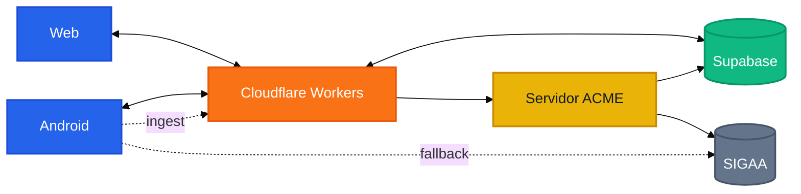
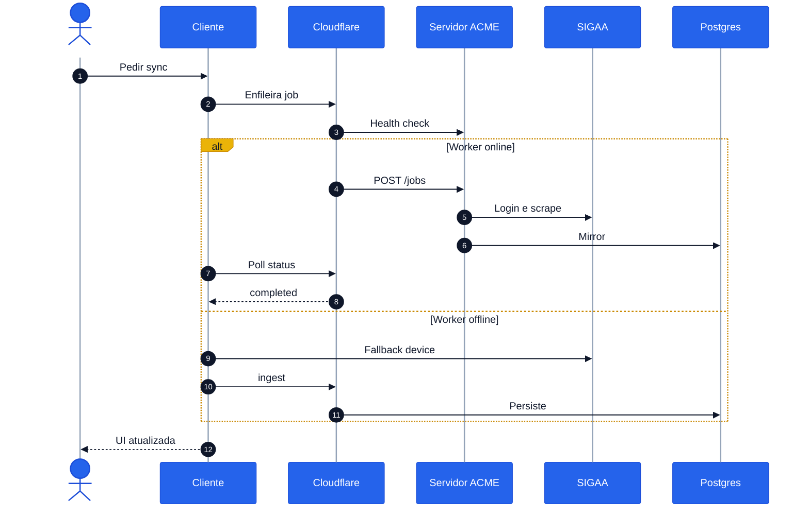
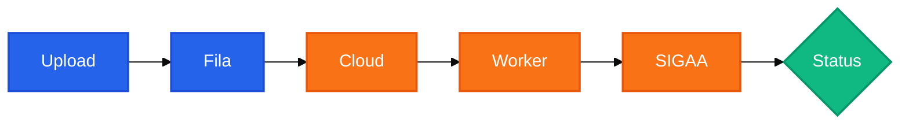
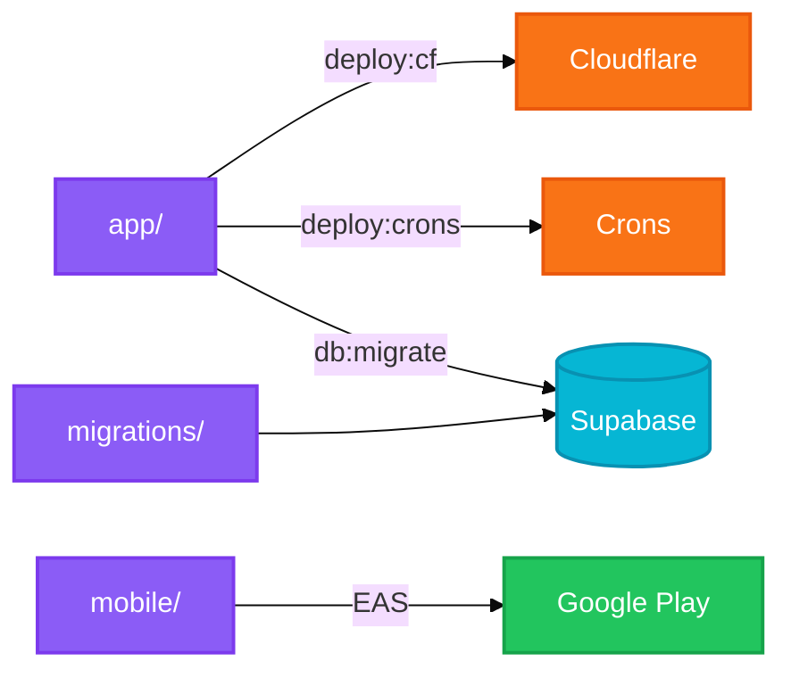
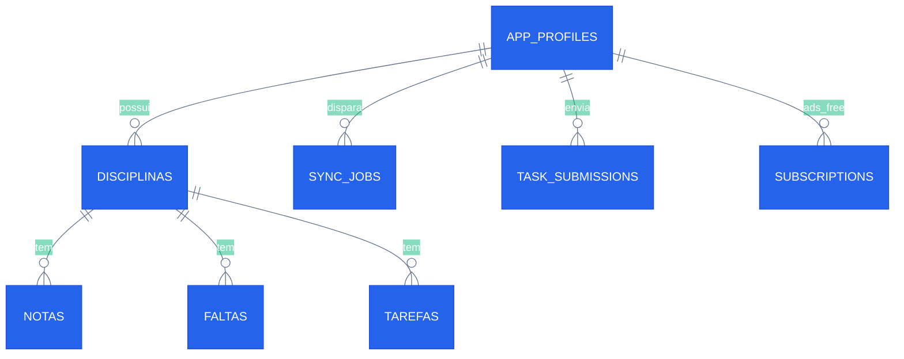

<p align="center">
  
</p>

<h1 align="center">ACME HUB</h1>

<p align="center">
  <strong>Planejador acadêmico gratuito</strong> para alunos do <strong>CEFET-MG</strong><br />
  Web + Android · sincronização com o <a href="https://sig.cefetmg.br/">SIGAA</a>
</p>

<p align="center">
  <a href="https://acmehub.com.br"></a>
  <a href="https://play.google.com/store/apps/details?id=br.cefethub.acme"></a>
  <a href="https://github.com/KairoHenrique/CEFET-Academic-Planner/releases/tag/v1.16"></a>
</p>

<p align="center">
  
  
  
  
  
  
  
  <a href="https://github.com/KairoHenrique"></a>
</p>

| | |
|---|---|
| **Site** | https://acmehub.com.br |
| **Google Play** | https://play.google.com/store/apps/details?id=br.cefethub.acme |
| **Versão** | `1.16` |
| **Repositório** | [github.com/KairoHenrique/CEFET-Academic-Planner](https://github.com/KairoHenrique/CEFET-Academic-Planner) |
| **Licença** | AGPL-3.0 |
| **Contato / LGPD** | acme.hubsuporte@gmail.com |
| **Privacidade** | https://acmehub.com.br/privacidade |
| **Termos** | https://acmehub.com.br/termos |

---

## Índice

1. [Visão geral](#1-visão-geral)
2. [Funcionalidades](#2-funcionalidades)
3. [Arquitetura](#3-arquitetura)
4. [Decisões de desenho (ADR)](#4-decisões-de-desenho-adr)
5. [Estrutura do repositório](#5-estrutura-do-repositório)
6. [Mapa do código](#6-mapa-do-código)
7. [Pré-requisitos](#7-pré-requisitos)
8. [Clonar e configurar](#8-clonar-e-configurar)
9. [Desenvolvimento local](#9-desenvolvimento-local)
10. [Servidor ACME (sync SIGAA)](#10-servidor-acme-sync-sigaa)
11. [Timeouts (Termux-first)](#11-timeouts-termux-first)
12. [APIs e robots](#12-apis-e-robots)
13. [Deploy](#13-deploy)
14. [App Android](#14-app-android)
15. [Testes](#15-testes)
16. [Variáveis de ambiente](#16-variáveis-de-ambiente)
17. [Fluxos principais](#17-fluxos-principais)
18. [Modelo de dados](#18-modelo-de-dados)
19. [Segurança e LGPD](#19-segurança-e-lgpd)
20. [Troubleshooting](#20-troubleshooting)
21. [Contribuindo](#21-contribuindo)
22. [Glossário](#22-glossário)
23. [Autor](#23-autor)
24. [Licença](#24-licença)

---

## 1. Visão geral

O **ACME HUB** concentra a vida acadêmica do aluno CEFET-MG em uma interface moderna:

- **Web** — Next.js na Cloudflare (OpenNext)
- **Android** — Expo / React Native
- **Sync** — dados do portal [SIGAA](https://sig.cefetmg.br/) via **Servidor ACME** (Playwright) ou fallback no aparelho

O produto é **gratuito**: as funções acadêmicas não têm paywall. Há anúncios na web (AdSense) e no Android (AdMob); a remoção de anúncios é oferecida via planos (PIX na web / Play Billing no app).

### Stack em uma frase

Next.js 16 + Cloudflare Workers · Supabase (Auth + Postgres + RLS) · Expo 54 · Playwright/Chromium no home-worker · cloudflared.

---

## 2. Funcionalidades

### Para o aluno

| Área | O que oferece |
|------|----------------|
| **Conta** | Cadastro / login com CPF + senha SIGAA, e-mail, telefone e aceite legal (LGPD) |
| **Sync** | Portal, notas, faltas, tarefas, calendário, histórico, turmas e saldo RU (quando habilitado) |
| **Dashboard** | Visão consolidada do semestre |
| **Disciplinas** | Notas, faltas, tarefas, simulação de médias |
| **Calendário** | Grade horária + agenda / eventos |
| **Mapa do curso** | Grafo de disciplinas / PPC |
| **Integralização** | Progresso curricular |
| **Simulador** | Choques de horário e elegibilidade |
| **Tarefas** | Envio de arquivo + comentário ao SIGAA |
| **Notificações** | In-app e push (Android) para prazos e sync |

### Cursos / PPC

Mapa e integralização usam o **PPC** do curso escolhido no cadastro (ex.: Engenharia da Computação).  
Seeds: `app/scripts/ppc_data*.txt` → `npm run db:seed-ppc` (com `DATABASE_URL`).

---

## 3. Arquitetura

### Visão geral do sistema



Fluxo preferido: clientes → Cloudflare → Servidor ACME → SIGAA, com mirror no Supabase. Se o worker estiver offline, o Android faz fallback e envia ingest.

### Papéis

| Peça | Função | Onde |
|------|--------|------|
| **Cloud (Workers)** | API, auth, UI web, fila de sync, crons, push | `app/` → OpenNext |
| **Supabase** | Contas, dados acadêmicos multi-tenant, RLS | `supabase/migrations/` |
| **Servidor ACME** | Login real no SIGAA, scrape, mirror, e-mail SMTP | `app/worker/` + scripts Termux/PC |
| **Mobile** | Mesma API; sync no aparelho se o worker estiver offline | `mobile/` |

### Por que essa divisão?

A Cloudflare **não** executa Chromium do SIGAA de forma confiável (limites de TLS/edge; scrape TLS no Worker gerou **Error 1102** e foi abandonado).  
O scrape pesado fica no **Servidor ACME**. A cloud **despacha** jobs e **persiste** o resultado no Postgres.

### Fluxo de sincronização



### Envio de tarefa ao SIGAA



### Camadas de deploy



---

## 4. Decisões de desenho (ADR)

Cada item tem espelho curto no código (comentários de cabeçalho).

### D1 — Forever-free

| | |
|---|---|
| **Onde** | `app/src/lib/billing/free-mode.ts`, `resolve-ads-free.ts` |
| **Flags** | `APP_IS_FREE = true`, `BILLING_ENFORCED = false`, `ADS_REMOVAL_CHECKOUT_ENABLED = true` |
| **Efeito** | Features acadêmicas sempre liberadas; checkout (PIX / Play) só para remoção de anúncios (`ads_free`) |
| **Por quê** | Produto forever-free; código sob AGPL-3.0 |

### D2 — Sync híbrido (worker preferido → aparelho)

1. Cloud tenta `SIGAA_WORKER_URL` (túnel do Servidor ACME).
2. Se offline → **Android** faz HTTP no SIGAA e envia snapshot (`POST /api/sync/ingest`).
3. Web sem worker: mensagem de aguardar / usar o app (sem scrape no edge).

Arquivos: `app/src/lib/sync-queue/`, `device-sync/`.

### D3 — Credenciais SIGAA cifradas

- Senha cifrada (AES-GCM) com `CREDENTIALS_ENCRYPTION_KEY` (mesma chave cloud ↔ worker).
- Preferir `passwordEnc` no payload do job.
- **Nunca** logar PII (CPF, senha, e-mail) em texto claro.

### D4 — Playwright no home-worker (não no edge)

SIGAA é portal legado (sessão, JS, formulários). Playwright + Chromium no Termux (`pkg`) ou Chrome no PC é o caminho estável.

### D5 — Um único Servidor ACME ativo

PC **ou** Termux — nunca os dois. Ambos atualizam `SIGAA_WORKER_URL`; dois túneis = sync quebrado.

### D6 — Timeouts Termux-first (~15 min)

Chromium em ARM é mais lento. Defaults alinhados para não declarar falha enquanto o scrape ainda corre. Ver [§11](#11-timeouts-termux-first).

### D7 — Postgres na cloud; SQLite só local/dev

- Produção: `PLANNER_DATABASE=postgres` + `PLANNER_CLOUD=true`.
- Guard `o2-cloud-sqlite-guard` impede SQLite como fonte de verdade nos Workers.
- Mirror: `SYNC_MIRROR_POSTGRES=true` no worker.

### D8 — Jobs assíncronos

`POST /jobs` com `execution: "async"` responde **202**; status em `sync_jobs` / `task_submissions`. Evita timeout HTTP na borda.

### D9 — E-mail via home-worker

`ACCOUNT_EMAIL_VIA_HOME_WORKER=true` + Gmail SMTP no worker (`POST /email/send`).

---

## 5. Estrutura do repositório

```
CEFET-Academic-Planner/          (produto: ACME HUB)
├── README.md
├── LICENSE                      ← AGPL-3.0
├── app/                         ← Next.js + API + scraper + home-worker + crons
│   ├── src/app/                 ← App Router + /api/*
│   ├── src/components/          ← UI web (+ ads)
│   ├── src/lib/                 ← domínio (ver §6)
│   ├── public/                  ← estáticos, ads.txt, app-ads.txt, logo
│   ├── scripts/                 ← migrate, deploy, Termux, tray
│   ├── worker/                  ← HTTP Playwright (:8787)
│   ├── workers/                 ← cron Workers Cloudflare
│   ├── tests/                   ← tsx --test
│   ├── wrangler.jsonc
│   └── .env.example
├── mobile/                      ← Expo Android
│   ├── app.json / app.config.js / eas.json
│   ├── src/ads/                 ← AdMob + gate ads_free
│   └── .env.example
├── packages/api-contracts/      ← tipos compartilhados web ↔ mobile
└── supabase/migrations/         ← SQL versionado
```

### Scripts Termux / PC

| Script | Função | Seguro no repo público? |
|--------|--------|-------------------------|
| `termux-servidor-acme.sh` | Worker + túnel + secret + crons | Sim (sem secrets) |
| `termux-form-env.sh` | Overrides Chromium/timeouts | Sim |
| `termux-export-env-from-pc.mjs` | Gera `.env.termux.local` a partir do PC | Sim (o **arquivo gerado** não) |
| `home-server-tray.ps1` | Tray Windows | Sim |
| `start-home-worker.mjs` / `start-temp-worker.mjs` | Worker (+ túnel) | Sim |

---

## 6. Mapa do código

### `app/src/lib`

| Pasta | Responsabilidade |
|-------|------------------|
| `auth/` | Sessão, CPF, pós-login |
| `billing/` | Free mode, `ads_free`, PIX, Play verify |
| `ads/` | Config AdSense web |
| `crypto/` | AES-GCM credenciais SIGAA |
| `db/` | Postgres / SQLite / bootstrap |
| `scraper/` | Playwright SIGAA |
| `worker/` | Config, job types, runners |
| `sync-queue/` | Fila, dispatch, poll, device fallback |
| `sync/`, `sync-mirror/`, `sync-ingest/`, `sync-orchestrator/` | Pipeline de sync |
| `task-submissions/` | Envio de tarefa + poll |
| `push/`, `notifications/`, `email/` | Push, lembretes, SMTP |
| `device-sync/` | Sync HTTP no aparelho |
| `legal/` | Consentimento / páginas legais |
| `calendar/` | Expansão de eventos / sessões |
| `retention/` | Purge de dados inativos |

Pontos de decisão no código: `billing/free-mode.ts`, `scraper/constants.ts`, `worker/config.ts`, `worker/server.ts`, `sync-queue/poll-sync-job-client.ts`, `scripts/termux-servidor-acme.sh`.

### `mobile/src`

| Pasta | Responsabilidade |
|-------|------------------|
| `ads/` | AdMob (App Open + interstitial) + cache `ads_free` |
| `screens/` | Telas (dashboard, planos, disciplinas, …) |
| `sync/` | Sync lite / turmas |
| `navigation/` | Shell + drawer |
| `api/` | Cliente HTTP tipado |

---

## 7. Pré-requisitos

- **Node.js** 20+ e **npm**
- Conta **Supabase** (`DATABASE_URL` do *Session pooler*)
- Conta **Cloudflare** (Workers)
- **Chromium** no Termux (`pkg`) **ou** Chrome/Playwright no PC
- Conta **Expo / EAS** para build da loja
- `cloudflared` no Termux/PC

---

## 8. Clonar e configurar

```bash
git clone https://github.com/KairoHenrique/CEFET-Academic-Planner.git
cd CEFET-Academic-Planner
```

### Web / API

```bash
cd app
npm install
npx playwright install chromium   # opcional no PC; Termux usa Chromium do pkg
cp .env.example .env.local
# Preencha .env.local — NUNCA commitar
```

### Mobile

```bash
cd mobile
npm install
cp .env.example .env
# EXPO_PUBLIC_API_BASE_URL=https://acmehub.com.br
# Firebase: secret EAS GOOGLE_SERVICES_JSON (produção)
```

---

## 9. Desenvolvimento local

### Site

```bash
cd app
npm run dev
# http://localhost:3000
```

Com `PLANNER_DATABASE=sqlite` e `SIGAA_SCRAPER_MOCK=true` dá para explorar a UI sem SIGAA real.

### Mobile (Expo)

```bash
cd mobile
npx expo start
```

> AdMob e Play Billing exigem build nativo (EAS). Expo Go não carrega o SDK de anúncios.

---

## 10. Servidor ACME (sync SIGAA)

Processo que a cloud chama para scrapar o SIGAA. **Preferência: Termux 24/7.**

### Termux (recomendado)

```bash
pkg install -y git nodejs python make clang curl cloudflared chromium

cd ~
git clone https://github.com/KairoHenrique/CEFET-Academic-Planner.git
cd CEFET-Academic-Planner

# Trazer .env do PC (uma vez):
# No PC: cd app && npm run termux:export-env
# Copie app/.env.termux.local → tablet em app/.env.local

cd app
bash scripts/termux-form-env.sh
bash scripts/termux-servidor-acme.sh
```

O script:

1. Mata processos antigos de worker/cloudflared  
2. Aplica `termux-form-env`  
3. `npm install` + rebuild `better-sqlite3` se preciso  
4. Sobe `worker:home` em `:8787`  
5. Sobe `cloudflared`  
6. Espera health local e público → `wrangler secret put SIGAA_WORKER_URL`  
7. Loops de cron locais (reminders 30m, account-emails 60m, orchestrator 15m)  
8. Monitora rotação do quick tunnel  

| Tecla | Ação |
|-------|------|
| `[r]` | `git fetch` + `reset --hard origin/main` e reinicia |
| `[c]` | CPU/RAM + health local |
| `[q]` | Encerra worker/túnel/crons |

**Não** há auto-update de git periódico (igual “abrir e deixar rodando” no PC).

```bash
cd ~/CEFET-Academic-Planner
git fetch origin
git reset --hard origin/main
```

### Windows (PC / tray) — opcional

```bash
cd app
npm run worker:home
npm run worker:tunnel
# ou tray: home-server-tray.ps1
```

### Health

- Local: `GET http://127.0.0.1:8787/health`  
- Público: `GET https://acmehub.com.br/api/sync/worker-health`

---

## 11. Timeouts (Termux-first)

Defaults no código (override via env), alinhados a tablet lento + UI que não desiste cedo.

| Camada | Default | Onde |
|--------|---------|------|
| Login Playwright | **90 s** | `SIGAA_LOGIN_TIMEOUT_MS` |
| Navegação | **60 s** | `SIGAA_NAVIGATION_TIMEOUT_MS` |
| Submit tarefa (nav floor) | **≥ 90 s** | `submit-portal-tarefa.ts` |
| Job inteiro (worker) | **15 min** | `SIGAA_WORKER_JOB_TIMEOUT_MS` |
| Grace shutdown | **18 min** | `SIGAA_WORKER_SHUTDOWN_MS` |
| Poll sync (cliente) | **15 min** | `poll-sync-job-client.ts` |
| Wait sync (servidor) | **15 min** | `wait-for-sync-job.ts` |
| Poll envio de tarefa | **≈ 15 min** | `poll-submission-status.ts` |
| Probe health worker | **4 s** | `probe-sigaa-worker-health.ts` |

> Após mudar polls no app: **`npm run deploy:cf`**. O worker Termux pega defaults no restart.

---

## 12. APIs e robots

### Home-worker (`:8787`)

| Método | Path | Auth | Função |
|--------|------|------|--------|
| `GET` | `/health` | — | Liveness |
| `GET` | `/status` | — | busy / acceptingJobs |
| `POST` | `/jobs` | Bearer | Dispara robot (sync ou async 202) |
| `POST` | `/email/send` | Bearer | SMTP Gmail |

Robots: `r1` (sync principal), `turmas`, `calendario`, `turmas-selecionadas`, `submit-tarefa`, `ru`.

### Cloud (amostra)

| Path | Função |
|------|--------|
| `POST /api/sync/queue` | Enfileira sync |
| `GET /api/sync/worker-health` | Sonda o túnel |
| `POST /api/sync/ingest` | Snapshot do device |
| `POST /api/billing/play/verify` | Valida compra Play → `ads_free` |
| `POST /api/cron/*` | Crons (`CRON_SECRET`) |

---

## 13. Deploy

```bash
cd app
npm run build:cf      # OpenNext
npm run deploy:cf     # Worker de produção
npm run deploy:crons  # ping, e-mails, orchestrator, reminders, …
npm run db:migrate    # supabase/migrations
```

Produção tipicamente exige:

- `PLANNER_CLOUD=true`, `PLANNER_DATABASE=postgres`
- `DATABASE_URL`, chaves Supabase, `CRON_SECRET`
- `CREDENTIALS_ENCRYPTION_KEY`, `WORKER_SHARED_SECRET` (**iguais** no Termux)
- `SIGAA_WORKER_URL` atualizado pelo script do túnel
- `PLANNER_APP_URL=https://acmehub.com.br`

Crons em `app/workers/`: `cron-ping`, `cron-account-emails`, `cron-notification-reminders`, `cron-sync-orchestrator`, `cron-app-update-notify`, `cron-ru-saldo`, `cron-purge-inactive-academic`.

---

## 14. App Android

| Campo | Valor |
|-------|--------|
| Nome | ACME HUB |
| Versão | `1.16` |
| Loja | [Google Play](https://play.google.com/store/apps/details?id=br.cefethub.acme) |

```powershell
cd mobile
npx eas-cli@latest build --platform android --profile production --non-interactive
```

| Profile | Artefato |
|---------|----------|
| **production** | AAB (loja) |
| **preview** | APK interno |
| **development** | APK debug / dev client |

`app.config.js` injeta `GOOGLE_SERVICES_JSON` e IDs AdMob via env EAS. Não versionar `google-services.json` real.

Bump: incrementar `version` (+ `versionCode` no `app.json`) → commit → EAS → Play Console.

Anúncios no app: **App Open** (abertura de sessão) e **Interstitial** (após sync, com cooldown). Gate por entitlement `ads_free`.

---

## 15. Testes

Node test runner via `tsx` em `app/tests/`.

```bash
cd app
npm test                 # suite rápida (mock SIGAA)
npm run test:o1          # health
npm run test:o2          # guard SQLite na cloud
npm run test:worker      # worker
npm run test:sync-queue  # fila
npm run test:f31         # auth / free mode
npm run test:t2          # RLS (precisa .env.local)
npm run test:scraper:live  # SIGAA real — cuidado
```

Smokes: `npm run smoke:cloud-sync` · `smoke:cron` · `smoke:t2`

| Tipo | O que valida |
|------|----------------|
| Parsers / domínio | HTML/SIGAA → modelos |
| Calendário / lembretes | Prazos e sessões |
| Worker / fila | Dispatch e sync híbrido |
| Postgres / RLS | Schema e isolamento |
| Auth / free | Pós-login e consent |
| Ops | Health e guard cloud |
| Push | Dedup / histórico |

**Não** commitar dumps HTML/PDF (`.data/`, `scrape-debug/`).

---

## 16. Variáveis de ambiente

Modelo: `app/.env.example` → `app/.env.local`.

### Obrigatórias em produção

| Variável | Para quê |
|----------|----------|
| `CREDENTIALS_ENCRYPTION_KEY` | Cifrar senha SIGAA (≥ 16) |
| `WORKER_SHARED_SECRET` | Bearer cloud ↔ worker (≥ 16) |
| `DATABASE_URL` | Postgres (Session pooler) |
| `NEXT_PUBLIC_SUPABASE_URL` | Cliente / auth |
| `NEXT_PUBLIC_SUPABASE_PUBLISHABLE_KEY` | Cliente |
| `SUPABASE_SERVICE_ROLE_KEY` | Só servidor |
| `CRON_SECRET` | Protege `/api/cron/*` |
| `SIGAA_WORKER_URL` | Túnel do Servidor ACME |
| `PLANNER_CLOUD=true` | Modo Workers |
| `PLANNER_DATABASE=postgres` | Backend de dados |

### Worker / Termux

| Variável | Para quê |
|----------|----------|
| `SYNC_MIRROR_POSTGRES=true` | Mirror no Postgres |
| `SIGAA_BROWSER_EXECUTABLE_PATH` | Chromium Termux |
| `SIGAA_HEADLESS=true` | Sem UI |
| `SIGAA_*_TIMEOUT_MS` | Ver §11 |
| `ACCOUNT_EMAIL_VIA_HOME_WORKER` | SMTP via worker |
| `GMAIL_SMTP_*` | Envio de e-mail |
| `CLOUDFLARE_API_TOKEN` | Secret do túnel |

### Mobile / EAS

| Variável | Para quê |
|----------|----------|
| `EXPO_PUBLIC_API_BASE_URL` | URL da API |
| `GOOGLE_SERVICES_JSON` | Firebase (secret EAS) |
| `ADMOB_*` | App ID e unit IDs (produção) |

### Play Billing (servidor)

| Variável | Para quê |
|----------|----------|
| `GOOGLE_PLAY_SERVICE_ACCOUNT_JSON` | Valida compras |
| `GOOGLE_PLAY_PACKAGE_NAME` | Package da loja (opcional; há default) |

**Nunca** commitar `.env*`, `google-services.json` real ou scripts que escrevem secrets.

---

## 17. Fluxos principais

### Cadastro

1. E-mail, telefone, CPF, curso, senha SIGAA + aceite legal.  
2. Cria usuário Auth + `app_profiles`.  
3. Acesso liberado (modo free).  
4. Sync inicial enfileirado (worker ou aparelho).

### Login

1. CPF + senha → JWT/sessão.  
2. Redirect para o dashboard.

### Sync

Ver diagrama em [§3](#fluxo-de-sincronização).

### Remoção de anúncios

1. Web: checkout PIX → webhook → `ads_free`.  
2. Android: assinatura Play → `POST /api/billing/play/verify` → `ads_free`.  
3. Clientes leem entitlement e ocultam AdSense / AdMob.

### Notificações / crons

Workers CF **e/ou** loops do Termux:

- `POST /api/cron/notification-reminders`
- `POST /api/cron/account-emails`
- `POST /api/cron/sync-orchestrator`

Header: `Authorization: Bearer $CRON_SECRET`.

---

## 18. Modelo de dados



| Área | Ideia |
|------|--------|
| Auth | Supabase Auth + `app_profiles` |
| Acadêmico | Disciplinas, notas, faltas, tarefas, turmas (tenant = `user_id`) |
| Sync | `sync_jobs` (status, robot, erros) |
| Submissões | `task_submissions` |
| Billing | Assinaturas / `ads_free` |
| Push | Tokens e fingerprints |
| PPC | Currículo para mapa e integralização |

RLS isola por usuário; suite `test:t2` valida.

---

## 19. Segurança e LGPD

- Minimize PII em logs.  
- Secrets só em `.env.local` / Cloudflare Secrets / EAS.  
- Repo público: **não** versionar históricos escolares, dumps SIGAA, tokens ou CPF reais.  
- Se um secret vazar: **rotacione** e limpe histórico se necessário.  
- LGPD: `/privacidade`, `/termos`; consentimento no cadastro (`legal/`).  
- Histórico Git já passou por purge antes de tornar o repo público — ainda assim, rotacione credenciais antigas se houve exposição.

---

## 20. Troubleshooting

| Sintoma | Causa comum | Ação |
|---------|-------------|------|
| `worker-health` offline | Túnel morto / secret antigo | Reiniciar Termux; checar health público |
| Sync web “aguarde” | Sem Servidor ACME | Ligar Termux (ou usar Android) |
| Túnel público não responde | trycloudflare lento | Script retenta; `[q]` e subir de novo |
| `git pull` divergent | Histórico local ≠ origin | `git fetch && git reset --hard origin/main` |
| Sync falhou cedo | Cloud sem polls 15 min | `npm run deploy:cf` |
| `password authentication failed` | `DATABASE_URL` velha | Regenerar senha Supabase |
| Push não chega | Falta Firebase no EAS | Secret `GOOGLE_SERVICES_JSON` |
| Error 1102 no Workers | TLS scrape no edge | Não reintroduzir scrape no Worker |
| better-sqlite3 no Termux | Binário errado | `npm rebuild` via script |

---

## 21. Contribuindo

1. Branch a partir de `main`.  
2. Não commitar `.env*`, `.data/`, APK/AAB, dumps.  
3. Rodar `npm test` (e suites relevantes) em `app/`.  
4. PR pequeno; descrever impacto em sync/auth/mobile/Termux.  
5. Commits conventional (`feat`, `fix`, `docs`, `chore`, `test`).  

### Checklist antes do push

- [ ] Sem secrets no diff  
- [ ] Timeouts/docs alinhados se mudou sync  
- [ ] Testes da área tocada  
- [ ] Scripts Termux sem valores secretos  

---

## 22. Glossário

| Termo | Significado |
|-------|-------------|
| **Servidor ACME** | Home-worker (Termux/PC) com Playwright + túnel |
| **Robot** | Tipo de job (`r1`, `submit-tarefa`, …) |
| **Mirror** | Gravar scrape direto no Postgres |
| **Ingest** | Device envia snapshot HTTP para a cloud |
| **Quick tunnel** | URL `*.trycloudflare.com` temporária |
| **Free mode** | Features acadêmicas sem paywall |
| **ads_free** | Entitlement que oculta anúncios |
| **OpenNext** | Adapter Next.js → Cloudflare Workers |

---

## 23. Autor

Projeto desenvolvido e mantido por:

<div align="center">
  <a href="https://github.com/KairoHenrique">
    
  </a>
  <br />
  <strong>Kairo Henrique Ferreira Martins</strong>
  <br />
  Estudante de Engenharia de Computação — CEFET-MG, Campus Divinópolis
  <br />
  <a href="https://github.com/KairoHenrique">github.com/KairoHenrique</a>
  ·
  <a href="mailto:kairohenrique293@gmail.com">kairohenrique293@gmail.com</a>
  ·
  <a href="mailto:acme.hubsuporte@gmail.com">acme.hubsuporte@gmail.com</a>
</div>

---

## 24. Licença

Este repositório está sob a licença **[AGPL-3.0](LICENSE)**.

© Kairo Henrique Ferreira Martins — ACME HUB
